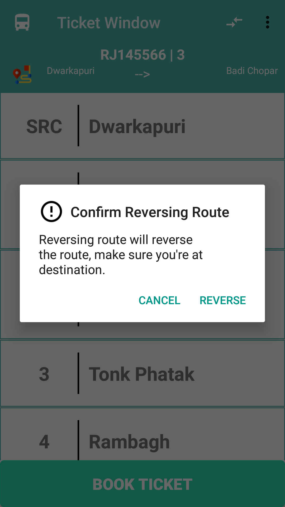
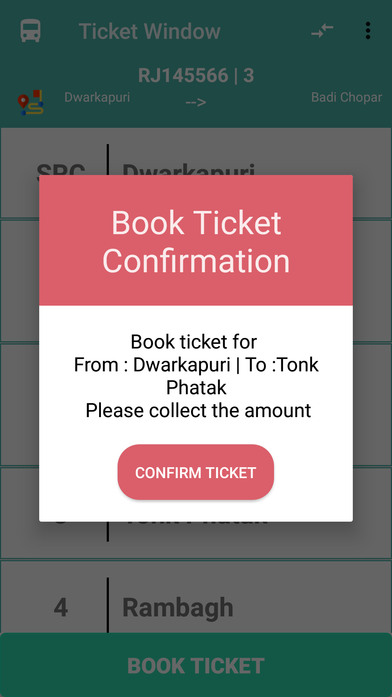
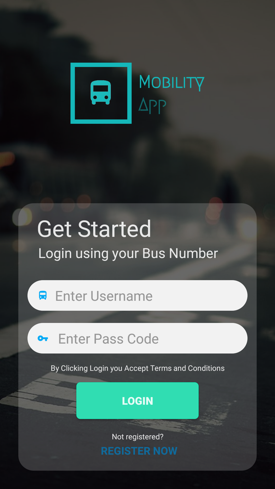

# mTraveller
### Hackathon 4.0 Project (Largest hackathon of the World)
The public transport companion that respects your privacy and your freedom. MmTraveller is a non-profit app developed to make using public transport as easy as possible wherever you are.
mTraveller App provides a soothing and easy environment for conductor as they are not very much technically educated. This also let government and people to Track bus location and allow
booking tickets. Conductor of ticket just have to select the destination, the Source is auto selected by our app.
#### The Data provided by this app will be implemented and used in mTravellerSurveilliance app for data processing and visulization of the statics.

<h3 align="center">
  Below are the screenshot of the App.
  </h3>

  
  

  
  

